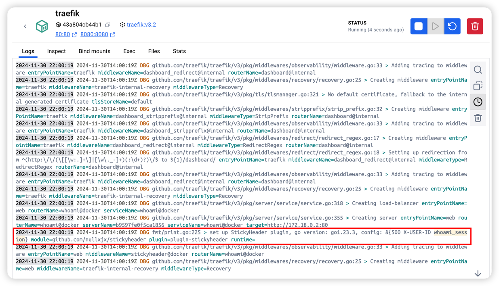
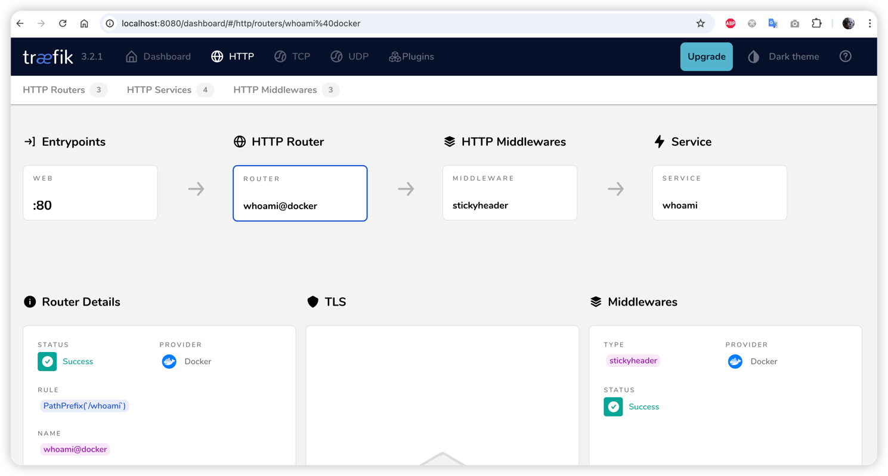
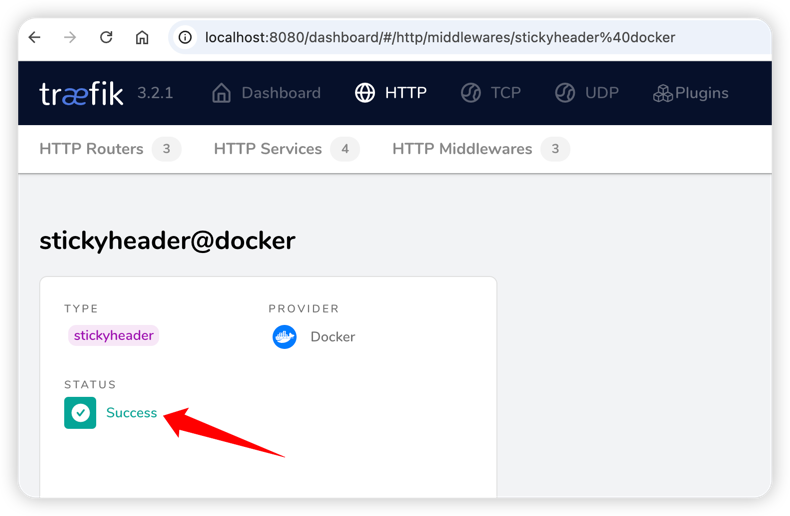

# StickyHeader

StickyHeader 是用于 [traefik](https://github.com/traefik/traefik) 的一个插件，它可以根据 header 实现 [sticky session](https://doc.traefik.io/traefik/routing/services/#sticky-sessions)

## introduction
traefik 使用 cookie 实现 [sticky session](https://doc.traefik.io/traefik/routing/services/#sticky-sessions)，且默认不支持基于 header 的会话保持能力（例如 IP Hash）。
但是有些业务场景需要根据 header 做会话保持。例如，[vllm](https://github.com/vllm-project/vllm/) 等大模型推理服务的 [prefix-caching](https://docs.vllm.ai/en/v0.5.5/automatic_prefix_caching/apc.html) 特性，希望将同一个用户的请求转发到同一个 vllm pod，这样可以提高 gpu 中的 kv cache命中率。

因此，此插件使用一个本地的 [lru cache](https://github.com/hashicorp/golang-lru)，存储请求中设置的 header 到 traefik 设置的 cookie 之间的映射关系，这样就可以将 traefik 基于 cookie 实现的会话保持能力，转换成基于请求 header 的会话保持能力。

## usage
1. 由于 [yaegi](https://github.com/traefik/yaegi) 暂时不支持 Go modules，因此需要先将仓库的依赖下载到本地 vendor 目录下
```bash
go mod tidy
go mod download
go mod vendor
```

2. 启动服务
```bash
cd demo
docker-compose up -d
```
执行命令后，可以从 traefik 日志中看到加载插件成功


同时，也可以在 traefik dashboard 看到这条路由成功应用上了这个插件




3. 测试基于 header 的会话保持能力
```bash
bash req.sh
```
修改 header 中的 X-USER-ID 的值，从响应结果中观察是否切换了一个 whoami pod。